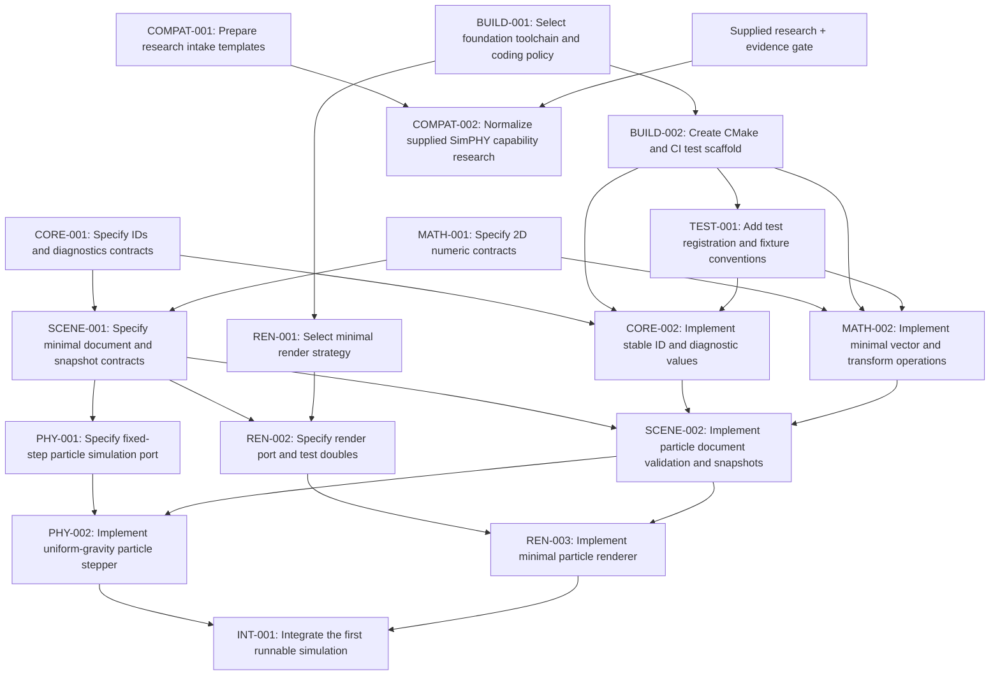

# Initial backlog and dependency graph

READY now: BUILD-001, CORE-001, MATH-001, COMPAT-001.

These four tasks have disjoint writable paths and can run concurrently after claims.
They create policy/contracts/templates, not simulator code. REN-001 waits for
the platform policy from BUILD-001 before selecting a compatible backend.

Build implementation waits for BUILD-001; renderer work waits for REN-001;
all component work waits for its contract/build prerequisites. COMPAT-002 waits
for supplied research, regardless of foundation progress. License/release and
distant-stage questions are listed in spec/open-questions.md.

Later parallel waves: CORE-002 with MATH-002; PHY-001 with REN-002; PHY-002 with REN-003.
Actual READY status always comes from the registry, not this initial snapshot.
