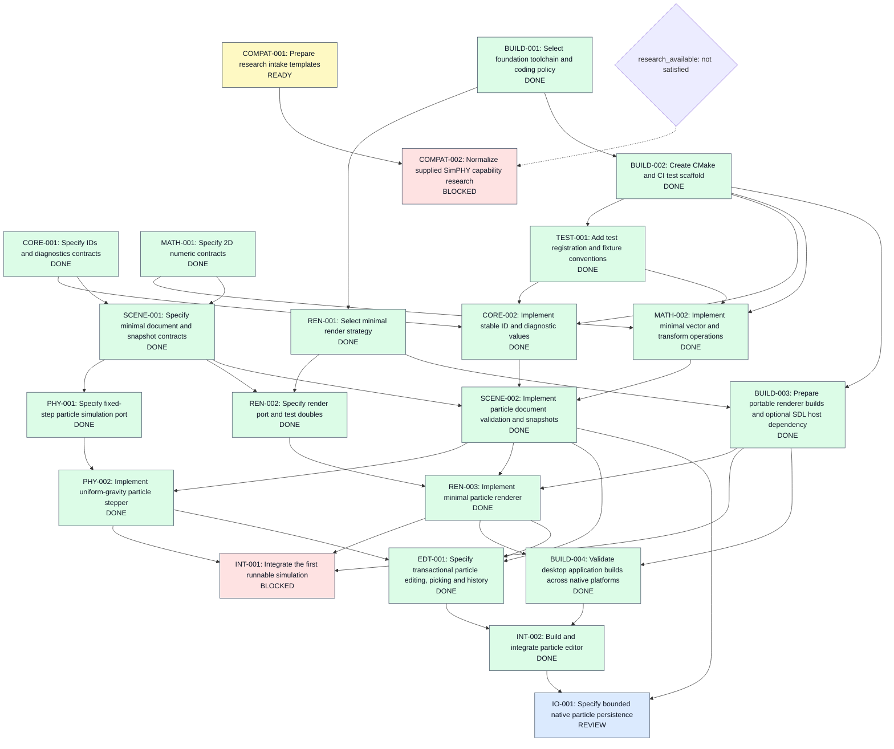
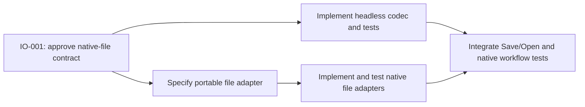

# Task dependency chart

Updated 2026-10-07 from [registry.json](registry.json). Arrows run from prerequisite
to dependent task. Status labels are a snapshot; the registry remains authoritative.

DONE: 18 | REVIEW: 1 | IN_PROGRESS: 0 | READY: 1 | BLOCKED: 2

- The particle editor demo (INT-002) is merged; this is not a finished product.
- IO-001 is in REVIEW: native-file contract and transactional persistence proposal.
- COMPAT-001 remains READY and unclaimed for the later small-task worker.
- INT-001 code is merged; only mixed-scale multi-monitor hardware evidence blocks completion.
- COMPAT-002 still requires COMPAT-001 and a reviewed research evidence gate.

## Persistence follow-ups after contract approval

These are sequencing proposals, not claimed or READY implementation tasks.
The coordinator assigns IDs and final scopes after IO-001 acceptance.

No future step is unblocked by a proposed contract alone. Platform adapters and
app integration remain separate from the pure codec; existing architecture edges
are unchanged. See [architecture](../spec/architecture.md) for the module DAG.
