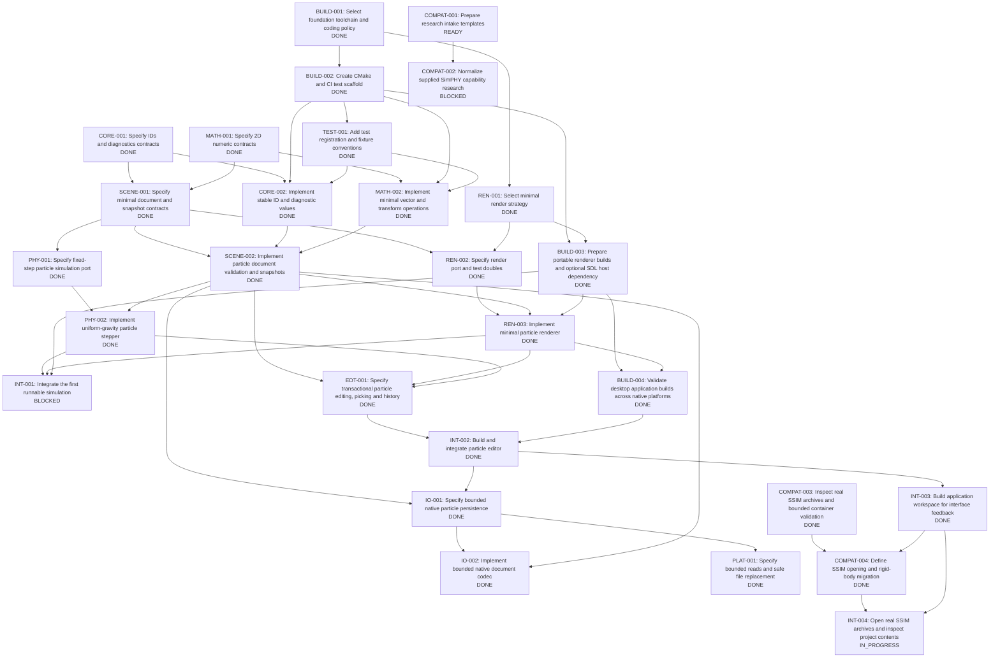

# Task dependency chart

Updated 2026-10-08 from [registry.json](registry.json). Registry is authoritative.

INT-003 workspace merged. COMPAT-004 delivery direction merged. INT-004 implements real SSIM opening/source preview; final CI pending.

DONE: 24 | REVIEW: 0 | IN_PROGRESS: 1 | READY: 1 | BLOCKED: 2

